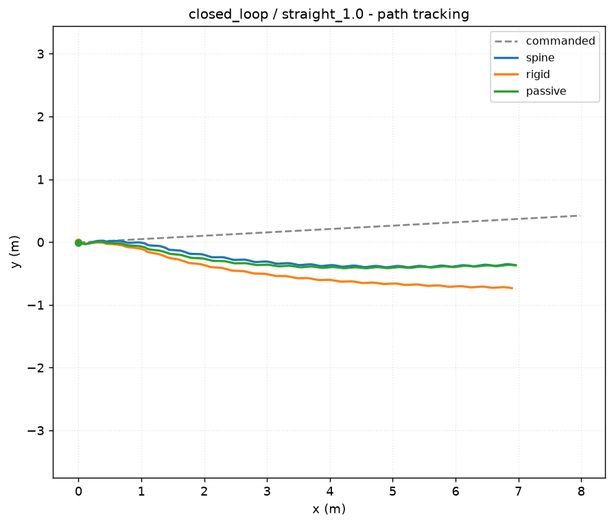
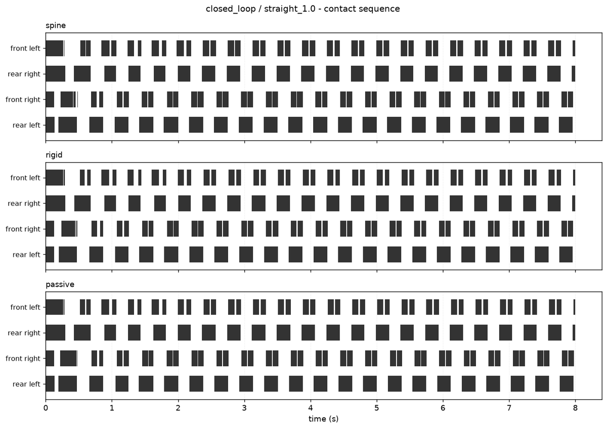
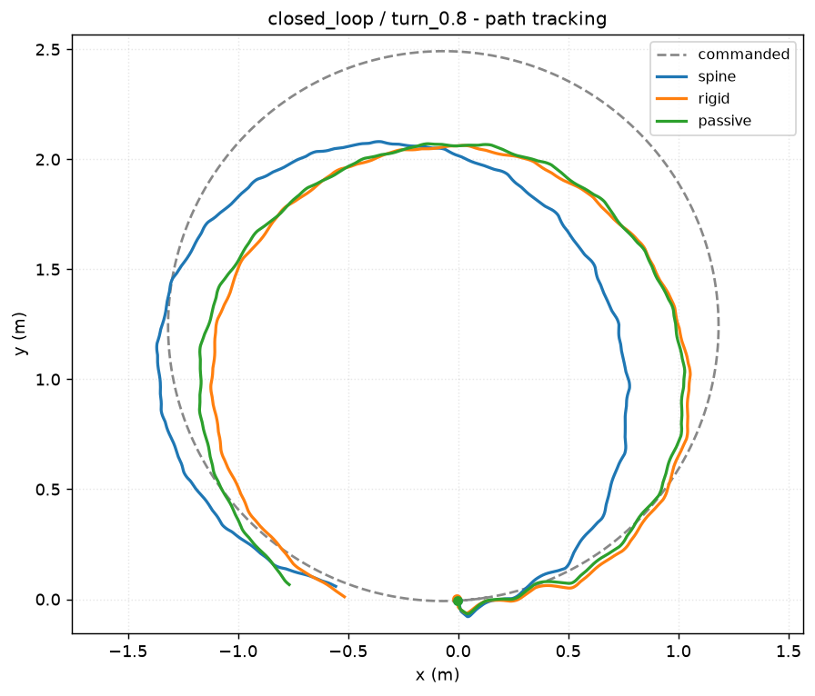
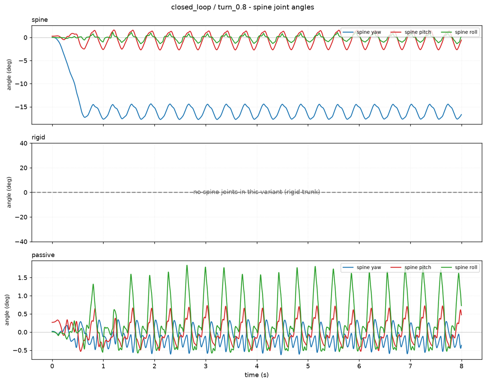
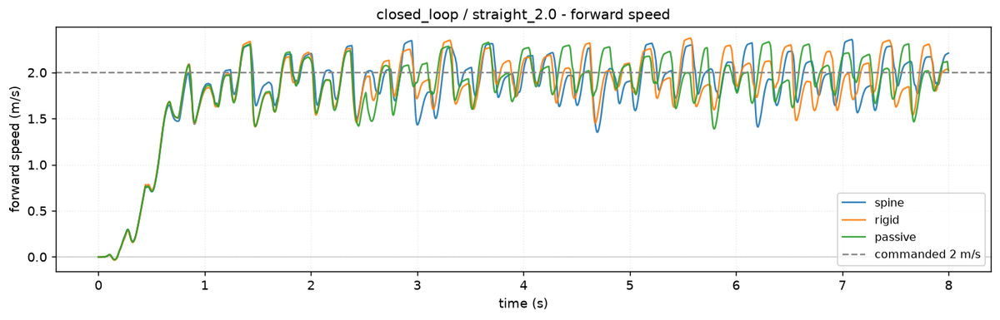

# Does an active spine help a quadruped run?

A controlled MuJoCo study of a cheetah-inspired quadruped with a 3-DOF active spine, measured against a rigid trunk and a passive compliant trunk under identical controllers. **The spine contributes nothing to straight-line running. Its only measurable benefit is turning, and that benefit comes entirely from holding a constant ~16° yaw offset — articulated steering, not spine undulation.**


*Active spine (left) and rigid trunk (right) running the same turn command from the same initial state. The spine model turns 6.1% faster. Watch the trunk: it holds a steady bend rather than oscillating — that constant offset is where the entire advantage comes from.*

## TL;DR

- **Straight-line running: no effect at all.** At 1.0 m/s the active spine, rigid trunk and passive spine reach 0.8641 ± 0.0003, 0.8639 ± 0.0003 and 0.8661 ± 0.0002 m/s. At 2.0 m/s: 1.7938 ± 0.0093, 1.7992 ± 0.0088, 1.8030 ± 0.0101 m/s. All three agree to within 0.5%, which is smaller than the spread across seeds.
- **Turning is the only real effect: +6.07% yaw rate** (0.7640 ± 0.0011 vs 0.7203 ± 0.0016 rad/s), and it requires actuation — the passive spine is 6.75% *worse* than rigid.
- **The mechanism is articulated steering, not undulation.** A spine that only holds a static yaw bias reproduces 104% of the advantage (0.766 vs 0.764 rad/s). A spine that only undulates, with the bias removed, is **4.9% worse than rigid**.
- **The active spine costs energy.** Cost of transport is 1.75–2.32% higher than rigid at every command tested.
- **Turning faster is not turning better.** The spine's cross-track error on the commanded circle is 17.8% *worse* than rigid (0.291 ± 0.005 vs 0.247 ± 0.003 m).
- The biological framing — that a cheetah's spine flexion is a propulsive mechanism worth engineering — does not survive the measurement here. Under a CPG controller, undulation is a cost, not a benefit.

## Background

The MIT Biomimetic Robotics Lab's early [Cheetah](https://biomimetics.mit.edu/) designs incorporated a compliant, articulated spine element, motivated directly by the sagittal flexion of a galloping cheetah. By the time of **Cheetah 3** (Bledt, Powell, Katz, Di Carlo, Wensing and Kim, *MIT Cheetah 3: Design and Control of a Robust, Dynamic Quadruped Robot*, IROS 2018), the trunk was rigid. The spine had been engineered away: it added mass, actuators, control complexity and failure modes, and the performance case for it did not hold up.

**S-Cheetah** ([arXiv:2605.27909](https://arxiv.org/abs/2605.27909), ShanghaiTech, 2026) revived the idea, adding a 3-DOF active spine (yaw → pitch → roll) and reporting locomotion gains. Those gains were reported **in simulation only, with no hardware**.

That is the disagreement this repo examines: two credible groups reached opposite conclusions about whether a quadruped should have a spine.

**What this repo is not.** It is not a replication of S-Cheetah's result. Their gains come from a *learned* controller; this study uses hand-written open-loop and closed-loop CPG controllers. A learned policy can co-adapt its gait to a spine in ways a fixed CPG cannot, and that is precisely where a spine would be most likely to pay off. What this repo establishes is a carefully controlled CPG baseline, and the finding that under that baseline the biological mechanism does not appear.

## Method

### Robot model

`spine_quadruped.xml` — a cheetah-proportioned quadruped, 6.769171 kg, MuJoCo `implicitfast` integrator at a 2 ms timestep.

- 12 leg joints (abduction, hip pitch, knee, per leg), torque limit ±33.5 N·m
- 3 spine joints in **yaw → pitch → roll** order, matching the S-Cheetah ordering, torque limit ±50 N·m
- 2-DOF weighted tail (yaw, pitch), torque limit ±8 N·m
- Thigh and calf 0.22 m each; hip-to-foot reach 0.363 m in the standing pose

### The three variants

All three are **mass-matched at 6.769171 kg**, verified at build time. That is what makes the comparison a test of trunk topology rather than of mass distribution.

| variant | construction | nq | nv | nu | njnt | spine joints |
|---|---|---|---|---|---|---|
| `spine` | unmodified: 3 spine joints, motor-driven | 24 | 23 | 17 | 18 | 3, actuated |
| `rigid` | spine `<joint>` and `<motor>` elements **deleted**; MuJoCo welds the child body to its parent at compile time | 21 | 20 | 14 | 15 | none |
| `passive` | spine joints kept with `stiffness=400`, `damping=12`; **all spine motors deleted** | 24 | 23 | 14 | 18 | 3, unactuated |

The rigid variant deletes joints rather than stiffening them. Stiffening a hinge to fake a weld degrades the mass-matrix conditioning and the solver diverges while still returning finite-looking numbers — a failure mode this study measured directly (see the calibration table below, `kp=1200` and `kp=4000` rows).

Construction is verified against the *compiled* model, never against the XML edit. `build_model` raises `ModelBuildError` if the surviving joint set differs from the request, if a removed motor is still present, if any actuator can still reach a spine joint in the passive variant, or if a kept passive joint has no spring. A regex that silently matches nothing is exactly how a fake "rigid" result gets made.

The `passive` variant exists to answer one question: **is any benefit compliance or control?** A PD controller holding a joint at zero with gains (kp, kd) is exactly a spring-damper of stiffness kp and damping kd, so the passive defaults match `kp_spine`/`kd_spine` and a passive spine is the same mechanical system as a held actuated one.

### Controllers

**Open-loop CPG.** Trot with an explicit stance/swing split and duty factor: the planted foot sweeps through stance while the knee flexes to clear ground through swing. Stride amplitude follows from the commanded speed geometrically — a foot planted through a stance sweep of 2A carries the body 2·A·0.363 m per cycle. Amplitudes ramp in over 0.6 s via smoothstep; a step discontinuity at gait onset saturates every actuator and throws the robot before it takes a stride.

Leg gait parameters (`freq=2.6`, `duty=0.75`, `knee_amp=0.95`, `kp_leg=150`, `kd_leg=6`) were selected by grid search **on the rigid model only**, scoring the worst case across two commanded speeds rather than the best. The rigid variant has no spine, so no spine setting could influence the choice. This biases the baseline in the rigid variant's favour, making any spine advantage measured against it conservative.

**Closed-loop layer.** Two feedback loops, both necessary for the metrics to mean anything:

- *Speed*: a PI loop on measured forward speed modulating gait frequency, with conditional-integration anti-windup. Without it, commanding 1.0 m/s produced 1.84 m/s and the command was a label rather than a target.
- *Path*: heading feedback plus a **cross-track position term**. Heading feedback alone cannot fix lateral error — driving yaw to the reference heading just makes the robot run *parallel* to the path at whatever offset it already had.

Spine steering follows the *commanded* yaw rate, not the feedback-corrected one; routing the correction through the spine as well as the legs double-counts it (see Errors, below).

Gait phase is integrated (`phase += freq·dt`) rather than computed as `freq·t`, because under a speed loop `freq(t)·t` is not the phase of a frequency-modulated oscillator.

**Asymmetric flexion.** A real cheetah's spine flexes roughly twice as far as it extends, so a symmetric sinusoid is the wrong prior. `asymmetric_wave(phase, ratio)` produces a unit oscillation whose flexion excursion is `ratio` times its extension; at `ratio=1` it degenerates to `sin()`, which is the control condition for testing whether the asymmetry matters at all.

### The calibration this study rests on

A spine **held at neutral must be dynamically equivalent to a deleted spine.** If it is not, every spine-vs-rigid number measures how well the spine is held rather than trunk topology. Eight seeds, 8 s, straight command, from `tools/calibration_table.py`:

| spine hold | net speed @1.0 | falls | deflection | net speed @2.0 | falls | deflection |
|---|---|---|---|---|---|---|
| **rigid (joints deleted)** | 0.864 ± 0.000 | 0/8 | — | 1.799 ± 0.009 | 0/8 | — |
| actuated, kp=120 kd=4 | 0.860 ± 0.000 | 0/8 | 2.36° | 1.799 ± 0.015 | 0/8 | 4.49° |
| **actuated, kp=400 kd=12** | **0.866 ± 0.000** | **0/8** | **0.78°** | **1.793 ± 0.017** | **0/8** | **1.71°** |
| actuated, kp=1200 kd=40 | 0.841 ± 0.001 | 0/8 | 1.04° | **0.995 ± 0.440** | **6/8** | 1.07° |
| actuated, kp=4000 kd=120 | 0.808 ± 0.004 | 0/8 | 2.14° | **1.429 ± 0.418** | **3/8** | 2.26° |
| passive spring k=400 c=12 | 0.866 ± 0.000 | 0/8 | 0.79° | 1.803 ± 0.010 | 0/8 | 1.81° |
| passive spring k=100 c=6 | 0.857 ± 0.000 | 0/8 | 2.49° | 1.781 ± 0.047 | 1/8 | 4.48° |

`kp_spine=400` is the operating point: a held spine matches the deleted spine at both speeds, with sub-2° residual deflection. Two things fall out of this table. First, the equivalence must be checked at *every* speed the study reports — `kp=120` looks fine at 1.0 m/s and is back-driven 4.49° at 2.0 m/s. Second, **stiffening breaks down exactly as expected**: at `kp≥1200` the robot falls on 3–6 of 8 seeds with the speed variance exploding to ±0.44. That is the numerical penalty for faking a weld with stiffness, and it is why the rigid variant deletes joints.

### Metrics

- **peak speed** — maximum of a 0.1 s moving average of body-frame forward speed. The raw per-step maximum is contact-impulse noise, not a speed anyone can use.
- **net progress** — net displacement projected on the *starting heading*, divided by elapsed time. **Signed**: negative when the robot goes the wrong way.
- **turn rate** — mean signed yaw rate, from unwrapped yaw.
- **cost of transport** — dimensionless, mechanical energy ∫Σ|τ·ω|dt divided by (m·g·distance). NaN rather than infinite when the robot did not move.
- **cross-track error** — RMS distance from the actual path to the *reference curve*, speed-independent. Reported separately from `path_error_rms_m`, which is measured against the time-parameterised reference and so conflates going off course with going slowly.
- **speed tracking error** — steady-state achieved speed (last 60% of the run) minus commanded. This is the number that decides whether a config label like `straight_1.0` is honest.

### Divergence policy

Any rollout that trips the stability monitor — non-finite `qpos`/`qvel`/`qacc`, velocity or position bounds, or MuJoCo's `mjWARN_BADQACC`/`BADQVEL`/`BADQPOS` counters — has **every** metric forced to NaN and prints an unmissable banner. There is no partial-credit path where the first 60% of a blown-up rollout gets averaged into a plausible number. NaN is visible in a CSV; a plausible float is not.

## Results

All results: 8 seeds with randomised initial joint angles, drop height, heading and trunk velocity; 8 s per rollout; identical leg gait across variants. **Zero falls and zero divergences in every row below.**

### Straight-line running: no effect

| command | variant | net progress (m/s) | peak speed (m/s) | cost of transport | cross-track (m) |
|---|---|---|---|---|---|
| 1.0 m/s | spine | 0.8641 ± 0.0003 | 1.0624 ± 0.0006 | 1.8090 ± 0.0011 | 0.497 ± 0.002 |
| 1.0 m/s | rigid | 0.8639 ± 0.0003 | 1.0670 ± 0.0017 | 1.7680 ± 0.0009 | 0.483 ± 0.003 |
| 1.0 m/s | passive | 0.8661 ± 0.0002 | 1.0650 ± 0.0027 | 1.7523 ± 0.0010 | 0.519 ± 0.003 |
| 2.0 m/s | spine | 1.7938 ± 0.0093 | 2.3183 ± 0.0109 | 1.4590 ± 0.0116 | 0.442 ± 0.058 |
| 2.0 m/s | rigid | 1.7992 ± 0.0088 | 2.3282 ± 0.0055 | 1.4302 ± 0.0077 | 0.480 ± 0.034 |
| 2.0 m/s | passive | 1.8030 ± 0.0101 | 2.3007 ± 0.0125 | 1.4236 ± 0.0097 | 0.527 ± 0.045 |

The active spine is **+0.02%** at 1.0 m/s and **−0.30%** at 2.0 m/s against rigid. Both are far inside the seed spread. The passive spine is +0.25% and +0.21% — equally null.

This is not "the spine helps a little". It is three mechanically different trunks producing the same speed. The only consistent difference is that the actuated spine **costs more energy**: cost of transport is 2.32% higher at 1.0 m/s and 2.01% higher at 2.0 m/s, and it is the only variant burning actuator power on the trunk.



*Straight-line path tracking at 1.0 m/s. The three variants are indistinguishable — the tracks overlay each other. Note the scale: total lateral excursion is under half a metre over roughly 7 m travelled, after the closed-loop path controller was added. Before it, the rigid variant alone drifted 2.3 m (see Errors).*



*Contact sequence at 1.0 m/s. Look for the diagonal pairing — front-left with rear-right, front-right with rear-left — and its regularity. This is what a working trot looks like; the asymmetry between front and rear stance durations is a property of the gait, not of the spine.*

### Turning: the one real effect, and it needs actuation

| variant | turn rate (rad/s) | vs rigid | cross-track (m) | cost of transport |
|---|---|---|---|---|
| spine | **0.7640 ± 0.0011** | **+6.07%** | 0.291 ± 0.005 | 2.2395 ± 0.0035 |
| rigid | 0.7203 ± 0.0016 | — | 0.247 ± 0.003 | 2.2010 ± 0.0090 |
| passive | 0.6717 ± 0.0013 | −6.75% | **0.232 ± 0.006** | 2.3005 ± 0.0099 |

Commanded yaw rate was 0.8 rad/s; all three undershoot. The active spine undershoots least.

The passive spine being *worse* than rigid is the load-bearing observation. Compliance alone does not help turning — it hurts. Whatever the spine is doing, it is doing it with its motors.

But the spine turns faster and tracks *worse*: cross-track error is 17.8% higher than rigid. It is overshooting the commanded circle, not following it more accurately.



*Turning at 0.8 rad/s. All three variants trace a real circle — compare against the pre-fix behaviour described in Errors, where neither variant turned at all. The spine track sits closer to the commanded circle than rigid here, but its RMS cross-track over the full run is higher; the advantage in rate does not translate into an advantage in tracking.*

[Side-by-side MP4: spine vs rigid on the turn command](docs/media/sidebyside_turn_0.8.mp4) (2.5 MB — GitHub shows relative-path MP4s as a download link, not an inline player; the GIF at the top of this page is the autoplaying version.)

### Mechanism: articulated steering, not undulation

The spine's yaw joint holds a near-constant −16° offset during a turn rather than oscillating. Decomposing the spine yaw command into its static and oscillatory parts and testing each alone, at 8 seeds:

| configuration | turn rate (rad/s) | vs rigid | spine yaw bias | spine yaw peak-to-peak |
|---|---|---|---|---|
| rigid | 0.720 | — | — | — |
| spine: full (bias + undulation) | 0.764 | +6.1% | −16.09° | 3.06° |
| **spine: static bias only** | **0.766** | **+6.3%** | −16.11° | 0.82° |
| **spine: undulation only** | **0.685** | **−4.9%** | −0.10° | 2.96° |
| spine: held neutral | 0.674 | −6.4% | −0.15° | 0.93° |
| passive spring | 0.672 | −6.7% | −0.15° | 0.96° |

**The static bias alone reproduces 104% of the advantage. The undulation alone is 4.9% worse than rigid.**

The spine is functioning as a steering joint — bending the body into the turn and holding it there, the way an articulated bus or a tractor-trailer steers. That is a legitimate engineering result and a real use for a spine DOF. It is not the mechanism the biological argument proposes, and the oscillatory flexion that argument is built on is actively harmful here.



*Spine joint angles during the turn. The claim rests on the blue trace: spine yaw sits at a sustained offset rather than oscillating about zero. Pitch and roll do oscillate, at a few degrees — and the undulation-only row above shows that contribution is negative.*

The realised sagittal flexion:extension ratio reached 0.43–0.66 against a commanded 2.0, so the asymmetric waveform is heavily attenuated by body loads back-driving the joint. The asymmetry reaches the setpoint but only partly reaches the joint.

### Speed tracking

| command | variant | commanded (m/s) | achieved (m/s) | error (m/s) |
|---|---|---|---|---|
| straight | spine | 1.0 | 0.9331 ± 0.0003 | −0.067 |
| straight | rigid | 1.0 | 0.9305 ± 0.0003 | −0.070 |
| straight | passive | 1.0 | 0.9341 ± 0.0001 | −0.066 |
| straight | spine | 2.0 | 1.9600 ± 0.0064 | −0.040 |
| straight | rigid | 2.0 | 1.9719 ± 0.0105 | −0.028 |
| straight | passive | 2.0 | 1.9701 ± 0.0139 | −0.030 |
| turn | spine | 1.0 | 0.8329 ± 0.0016 | −0.167 |
| turn | rigid | 1.0 | 0.8512 ± 0.0049 | −0.149 |

Commanded speeds are tracked to within 7% at 1.0 m/s and 2% at 2.0 m/s, so the configuration labels mean what they say. Under a turn command all variants lose about 17% of commanded speed, which is expected — turning costs forward progress.



*Forward speed at the 2.0 m/s command. Look at where the traces settle relative to the dashed commanded line, and at how little separates the three variants — this is the same null result as the table, in time-series form.*

## What this does and does not show

**Shows.** Under a tuned CPG controller with closed-loop speed and path tracking, on this robot: an active 3-DOF spine gives no straight-line benefit over a rigid trunk at either tested speed; a passive compliant spine gives no benefit either, so the null is not a control-authority failure; the spine's 6.07% turning advantage is real, requires actuation, and is 104% attributable to a static yaw bias; oscillatory spine undulation is measurably harmful in turning and neutral-to-costly in straight running.

**Does not show.** That an active spine is useless in general. Specifically:

- **One morphology.** A single robot at 6.77 kg with fixed segment lengths and mass distribution. Spine benefit plausibly depends on trunk length, mass fraction and leg-to-spine inertia ratio, none of which were varied.
- **One turn rate.** Turning was tested only at 0.8 rad/s. The turning result may not extrapolate to tighter or gentler turns, and the spine's overshoot suggests its behaviour is rate-dependent.
- **CPG, not learned control.** This is the central limitation. S-Cheetah's claim is about learned policies. A fixed CPG cannot co-adapt gait timing, footfall placement and spine phase together, and that coupling is where a spine would most plausibly pay off. This study does not refute their result; it establishes that the effect does not appear under hand-designed control.
- **Trot only.** The gait is a trot. A bounding or galloping gait loads the sagittal spine very differently, and that is the gait the biological argument is actually about. `bound` is implemented but showed continuous yaw instability (−7.72°/s) and was not used for the comparison.
- **Simulation only, no hardware.** Same limitation S-Cheetah has. Contact modelling, actuator dynamics and structural compliance are all idealised. No claim here transfers to a physical robot without validation.
- **Tracking trade-off unresolved.** The spine turns 6.07% faster while tracking the commanded circle 17.8% worse. Whether that is a net benefit depends on whether you want yaw authority or path accuracy, and this study does not settle which matters.

## Errors found and corrected

Every result above was produced by code that had, at some point, a defect producing confident and wrong numbers. This section exists because the credibility of the rest depends on it.

**1. Inverted hip sign — the robot ran backwards at 1.7 m/s.** `hip_pitch` rotates about +y, and R_y maps the downward leg vector (0,0,−L) to x = −L·sin(θ), so *increasing* hip pitch drives the foot toward −x. The stance sweep ran the wrong way. The robot trotted smoothly in reverse and **survived an entire 108-point grid search**, ranking first, because the search scored an unsigned displacement norm — which scores fast-reverse as fast. Caught by noticing that the top-ranked configuration had `peak_speed ≈ −0.007` m/s alongside a 1.688 m/s "net displacement". Fixed in `05d7779`; the metric that hid it fixed in `99aa744`.

**2. Unsigned speed metrics.** The direct enabler of error 1. `net_displacement_speed_mps` used `‖p_end − p_start‖`, discarding direction. Replaced with `net_progress_speed_mps`, the displacement projected on the starting heading, which goes negative when the robot goes the wrong way. `99aa744`.

**3. Deterministic seeds averaging identical rows.** The CPG has no noise source, so `--seeds 0,1,...,7` produced eight bit-identical rollouts and the reported standard deviations were exactly zero by construction. Averaging eight copies of one number is not evidence. Fixed by randomising initial joint angles, drop height, heading and trunk velocity per seed (`42c52a2`). The immediate consequence: the spine variant turned out to fall on 4 of 8 seeds under settings that had looked clean on the single deterministic run.

**4. Command never reached the controller.** The commanded velocity reached the metrics' reference path but not the controller, so `straight_1.0`, `straight_2.0` and a 0.8 rad/s turn produced three *identical* result rows. The sweep was silently comparing nothing. Caught by noticing the identical rows. `876650b`.

**5. Inverted turn gain — nearly reported "the spine is worse at turning".** `turn_spine_gain` had the wrong sign, so the spine yaw bias fought the differential-stride turn instead of assisting it, cutting achieved yaw rate to 0.466 rad/s against a commanded 0.8. This was about to be written up as a spine deficit. Testing the sign explicitly gave 1.110 rad/s at −0.35 and 1.313 at −0.70. `b781c70`.

**6. Withdrawn claim: the +8.4% straight-line advantage at 2 m/s.** An earlier report gave the spine 1.856 m/s against rigid's 1.712 m/s at the 2.0 m/s command. That figure rested partly on the rigid variant falling on one of eight seeds. Recomputed on the six seeds where nothing fell, it dropped to **+2.3% and inside the noise**; after the controller defects below were fixed, it became **−0.30%**. The claim is withdrawn. It should never have been reported without the fall-exclusion check.

**7. Heading loop routing through the spine gain — 8 of 8 falls, and four wrong explanations.** After the closed-loop layer was added, the actuated spine fell on every seed at 2.0 m/s while a passive spring of identical stiffness never fell. Those should be the same mechanical system. Four hypotheses were tested and rejected: torque saturation (peak spine torque 20.1 N·m against a 50 N·m limit, 0% of samples saturated, and raising the limit to 400 N·m changed nothing); explicit-versus-implicit integration; explicit PD damping; and gain tuning (it fell at *every* gain from 60 to 400). The tell was that spine deflection stayed at 5.2° regardless of gain — meaning the deflection was **commanded, not compliant**. The cause was in the new controller: the heading loop's correction was routed through `turn_spine_gain` as well as through the legs, so on a *straight* command the "held" spine sat at a continuous 5° steering deflection and over-steered at speed. Fixed by having spine steering follow only the commanded yaw rate (`67c6c81`). With the fix, a truly held spine matches rigid and passive at both speeds.

**8. Lateral drift that was being reported as steering quality.** The rigid variant drifted 2.3 m laterally over 10 m on a straight command, making cross-track error a measure of that defect rather than of steering. Root-caused to a one-time yaw impulse at gait onset: `yaw(t)` is flat until 0.6 s, swings to −13.6° by 1.8 s, then holds, with a late-time rate of only −0.66°/s. Confirmed by mirroring the left/right phase assignment, which flipped the drift exactly (−2.27 m → +2.19 m), and by the `walk` gait — where feet land one at a time — showing +0.37°. A secondary contributor was the tail, which has actuators the controller simply never commanded; holding it cut the late-time drift rate from −0.66 to −0.08°/s. Fixed by adding cross-track position feedback and holding the tail (`d37d185`). Straight-line cross-track fell from 1.46–1.77 m to 0.44–0.52 m.

**9. A sanity check that cried wolf.** The joint-stiffness stability bound was evaluated against the *global minimum* armature, pairing a stiff spine spring with a leg's 0.01 armature and producing a bound 20× too small, and it ignored the integrator. It fired on every healthy passive-variant run. A warning that fires on correct models is worse than no warning, because it teaches you to ignore the ones that matter. `71f607d`.

## Reproducing

Requires Python 3.11+. Dependencies: `mujoco`, `stable-baselines3`, `gymnasium`, `numpy`, `matplotlib`, plus `imageio` and `imageio-ffmpeg` for MP4 output.

```bash
python -m venv .venv && .venv/bin/pip install torch --index-url https://download.pytorch.org/whl/cpu
```

```bash
.venv/bin/pip install mujoco gymnasium stable-baselines3 numpy matplotlib imageio imageio-ffmpeg
```

Verify the environment, model integrity and numerical stability before trusting anything:

```bash
python harness.py check
```

This prints the GL backend, all three variants' DOF counts, confirms mass-matching and joint removal, and runs a 5 s shakedown at zero and full-amplitude random torque on each variant. It exits non-zero if joint removal failed or anything diverged.

The main comparison — measured at 3.1 minutes headless on a laptop CPU, 5.6 minutes with `--render`:

```bash
python harness.py run --name closed_loop --variants spine,rigid,passive --seeds 0,1,2,3,4,5,6,7 --duration 8.0 --render
```

The spine-hold calibration table (5.0 minutes):

```bash
python tools/calibration_table.py
```

Spine undulation amplitude sweep including the zero-amplitude control (3.1 minutes):

```bash
python harness.py spine-sweep
```

The corrected free-fall reorientation test, which drives each variant with the DOF it actually has:

```bash
python harness.py freefall
```

Rendering is off by default so experiments stay fast. `MUJOCO_GL` is set automatically before `mujoco` is imported — `glfw` on macOS and Windows, `egl` then `osmesa` on Linux — and an explicit environment setting always wins. If a GL context cannot be created the numeric experiments still run to completion and say so loudly; they are never silently skipped.

### Provenance

Every run writes `results/<name>/results.json` alongside `metrics.csv`, recording the git commit and whether the tree was dirty, Python/MuJoCo/NumPy versions, the resolved GL backend, the full config, each variant's compiled DOF counts and mass, whether mass-matching held, and a **per-rollout stability verdict** — divergence reasons, first bad step, peak `|qvel|` and `|qacc|`, and MuJoCo warning counts. A result can therefore be distrusted later on evidence rather than on memory.

## Repository layout

```
cheetah/
  __init__.py     sets MUJOCO_GL before mujoco is imported anywhere
  glbackend.py    GL backend selection and a probe that actually renders a frame
  model.py        the three variants; verified against the compiled model
  control.py      CPG, asymmetric flexion waveform, closed-loop speed and path loops
  rollout.py      the single place physics is stepped and divergence is detected
  metrics.py      locomotion metrics; NaN-on-divergence policy
  stability.py    per-step divergence detection and model sanity checks
  render.py       offscreen rendering, MP4, side-by-side compositing
  plots.py        gait diagrams, spine angle traces, trajectories, speed traces
  experiment.py   config -> CSV/JSON harness
harness.py        CLI: check, run, spine-sweep, freefall
tools/            calibration table and README media generation
spine_quadruped.xml
docs/media/       the curated figure set this README embeds (~4.2 MB)
```

`media/` and `results/` are gitignored; a full render run is about 17 MB and is cheap to regenerate. `docs/media/` is the size-budgeted subset the README needs, rebuilt with `python tools/make_readme_media.py`.

## Citation

If this study is useful, cite it as a negative result on CPG-controlled spine locomotion:

```bibtex
@software{alharbi2026spine,
  author = {Alharbi, Muhannad},
  title  = {Does an active spine help a quadruped run? A controlled MuJoCo study},
  note   = {Independent CPG-based study of active, passive and rigid quadruped
            trunks. Finds no straight-line benefit and attributes the turning
            benefit to articulated steering rather than spine undulation.},
  year   = {2026},
  url    = {https://github.com/cl0udz1/Cheetah-Spine-Experiment}
}
```

The works this study responds to are cited in [Background](#background).

## Licence

[MIT](LICENSE). Copyright (c) 2026 Muhannad Alharbi.

`spine_quadruped.xml` and `run.py` are the original starter files, preserved unmodified in commit `cbe923a` for reference; `run.py` is superseded by `harness.py` and its free-fall test is corrected in `harness.py freefall` (the original drove the spine on the spine variant and drove nothing on the rigid variant, so its 0° result measured the absence of a command rather than the absence of a capability).
